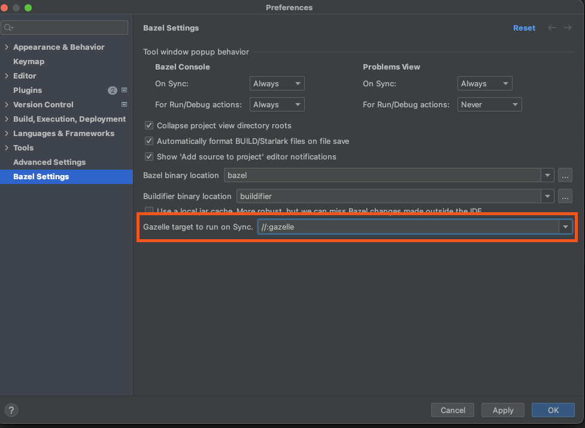

# IntelliJ Gazelle Plugin

This is a standalone IntelliJ Plugin that hooks onto the [upstream Bazel IntelliJ plugin](https://github.com/bazelbuild/intellij) to **run Gazelle on Sync**.

## Installation & Usage

Currently, this plugin is not available in the JetBrains Marketplace. Please follow (Building From Source)[#building-from-source].

Once installed, there are two main ways to configure the plugin; Per-project, and global configuration.

### Per-project Configuration

The most straightforward way to configure the plugin is to add the following to your `.bazelproject` file to point the plugin to the right Gazelle target:

```
# .bazelproject.
# No, there's no ':' after `gazelle_target`.
gazelle_target //:gazelle
```

Note that this change will break folks not using this plugin.
If your team checks their `.bazelproject` file into the repository, you'll have to clone it and create your own.
Luckily, one can import the original file:

```
# Bazel > Project > Open Project View File...
import your/teams/.bazelproject

gazelle_target //:gazelle
```

If this solution is not satisfactory, or if **you only work in a single project**, you can configure the plugin globally:

### Global Configuration

This plugin adds some fields to the Bazel plugin's settings, found in `Cmd+, > Bazel Settings`.
Currently, you can configure a gazelle target to act as a global default.
This target will:

* Enable the plugin globally, and
* Run that target on sync if no other target is specified in the `.bazelproject` file.



## <a name="building-from-source"></a> Building From Source

### Setup

The plugin is built with Gradle, so you will need to [install it following official instructions](https://gradle.org/install/).

### Building the Plugin

```
./gradlew clean && ./gradlew buildPlugin
```
The plugin should be in `build/distributions/intellij_gazelle-1.0.zip`.

### Testing the Plugin

To test the plugin, follow the [official instructions](https://www.jetbrains.com/help/idea/managing-plugins.html#install_plugin_from_disk) to load the built plugin into IntelliJ.
Test manually with a test project.

### Debugging the Plugin

If you have IntelliJ ultimate or Goland, you can [follow the official instructions](https://plugins.jetbrains.com/docs/intellij/running-and-debugging-a-plugin.html) to open this repository in IntelliJ and launch a debugging instance.

## FAQ

### Why is this not part of the regular Bazel plugin?

Gazelle is not considered a core workflow of Bazel. Any project in any language can work without Gazelle.
Therefore, the maintainers deemed it would be better suited as a standalone plugin.

References:
- [Bazel IntelliJ issue](https://github.com/bazelbuild/intellij/issues/3216).

### Why is this built with Gradle (and not Bazel)?

At the moment, one needs to download and version numerous InteliJ SDKs to support different flavours of IntelliJ.
Furthermore, the locations to download those SDKs from are brittle without non-trivial work. Early experimentation showed that a naive implementation was not sufficient.
The upstream Bazel plugin has implemented this logic, but it's not readily consumable as a ruleset, and making it consumable also requires non-trival work.
For now, this remains built with Gradle, but the project would gladly accept contributions to build it with Bazel.

